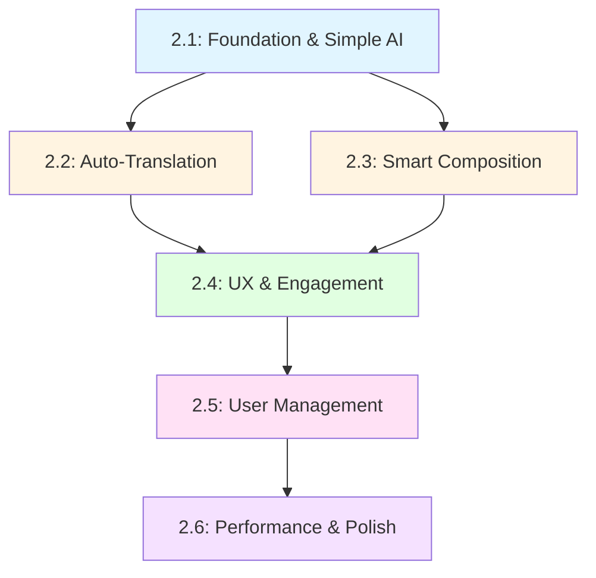

# MessageAI – Phase 2 Sub-Phase Breakdown

This document breaks down Phase 2 (International Communicator) into logical sub-phases for incremental development and continuous delivery.

**Original Phase 2 Timeline:** 2 days (48 hours)  
**Sub-Phase Structure:** 6 sub-phases building on each other

---

## 📋 Sub-Phase Overview

| Sub-Phase | Focus Area | Duration | Deliverable |
|-----------|-----------|----------|-------------|
| **2.1** | Foundation & Simple AI | 6-8 hours | 3 working AI features + Cloud Functions setup |
| **2.2** | Auto-Translation | 6-8 hours | Automatic translation with orchestration |
| **2.3** | Smart Composition | 4-6 hours | Formality adjustment + AI-powered replies |
| **2.4** | UX & Engagement | 6-8 hours | Message reactions + visual polish |
| **2.5** | User Management | 4-6 hours | Chat control + blocking features |
| **2.6** | Performance & Polish | 4-6 hours | Optimization + testing + demo prep |

**Total Estimated Time:** 30-42 hours (flexible scheduling)

---

## 🔧 Sub-Phase 2.1: Foundation & Simple AI Features

**Goal:** Establish AI infrastructure and deliver 3 immediately useful features

**Duration:** 6-8 hours

### Scope

#### Infrastructure Setup
- [x] Set up Firebase Cloud Functions project structure
- [x] Integrate OpenAI API (secure key management)
- [x] Create base `/translateMessage` endpoint
- [ ] Configure rate limiting and error handling
- [ ] Test Cloud Functions deployment

#### Feature 1: Inline Translation
- [ ] Long-press menu option "Translate"
- [ ] Loading spinner during translation
- [ ] Display translated text inline (toggle between original/translation)
- [ ] Cache translation results in Firestore (`aiMeta.translatedText`)
- [ ] UI: Simple tap to toggle original/translation

#### Feature 2: Cultural Context Hint
- [ ] Message toolbar button "Explain"
- [ ] Cloud Function call to GPT for cultural/contextual explanation
- [ ] Display explanation in a modal or expandable section
- [ ] Cache explanations to reduce API calls

#### Feature 3: Slang/Idiom Explanation
- [ ] Message toolbar button "What does this mean?"
- [ ] GPT provides simple definition/explanation
- [ ] Display inline or in tooltip
- [ ] Cache results

### Technical Details

**Cloud Function Structure:**
```typescript
// functions/src/translateMessage.ts
export const translateMessage = functions.https.onCall(async (data, context) => {
  const { messageId, action, targetLang } = data;
  // action: 'translate' | 'explain' | 'define'
  // Validate auth, call OpenAI, return result
});
```

**Firestore Schema Addition:**
```typescript
messages/{id}.aiMeta = {
  detectedLang?: string,
  translatedText?: { [lang: string]: string },
  explanation?: string,
  slangDefinition?: string
}
```

**UI Pattern:**
```typescript
// Long-press menu for messages
<MessageBubble 
  onLongPress={() => showMenu(['Translate', 'Explain', 'Define'])}
/>
```

### Success Criteria
- ✅ Cloud Functions deployed and working
- ✅ 3 AI features functional on device
- ✅ Translations appear in < 3s
- ✅ Results cached (subsequent views instant)
- ✅ Error handling graceful (shows original message if fails)

### Testing Focus
- OpenAI API integration works
- Rate limiting prevents abuse
- Offline behavior (shows cached results)
- Cost monitoring (token usage tracking)

---

## 🌐 Sub-Phase 2.2: Auto-Translation & Language Detection

**Goal:** Make translation proactive and automatic with user preferences

**Duration:** 6-8 hours

### Scope

#### Feature 4: Language Detection & Auto-Translate
- [ ] Detect incoming message language automatically
- [ ] Per-conversation toggle: "Auto-translate messages"
- [ ] Per-conversation preference: "Always translate to [language]"
- [ ] Show loading indicator during translation
- [ ] Store preference in Firestore (`conversations.aiPrefs`)

#### Advanced: Proactive Auto-Translate Orchestrator
- [ ] Cloud Function `/ai/processIncomingMessage`
- [ ] Multi-step workflow:
  1. Detect language
  2. Lookup conversation preferences
  3. Decide: translate if `autoTranslate=true` and `lang!=targetLang`
  4. Persist results
  5. Learn from user feedback ("Always translate to X")
- [ ] Optional: Translation quality feedback (thumbs up/down)
- [ ] Update preference when user selects "Always translate"

#### UI Enhancements
- [ ] Settings chip in chat header: "🌐 Translating to English"
- [ ] Quick toggle in chat header to enable/disable auto-translate
- [ ] Language selector dropdown per conversation
- [ ] Visual indicator when message is auto-translated

### Technical Details

**Firestore Schema Extension:**
```typescript
conversations/{id}.aiPrefs = {
  targetLang: string,           // e.g., 'en', 'es', 'fr'
  autoTranslate: boolean,       // Enable/disable auto-translate
  defaultTone?: string          // For future formality features
}

messages/{id}.aiMeta = {
  detectedLang: string,
  translatedText: string,
  feedback?: 'positive' | 'negative'
}
```

**Cloud Function - Orchestrator:**
```typescript
export const processIncomingMessage = functions.firestore
  .document('messages/{messageId}')
  .onCreate(async (snap, context) => {
    const message = snap.data();
    
    // 1. Detect language
    const detectedLang = await detectLanguage(message.text);
    
    // 2. Get conversation preferences
    const prefs = await getConversationPrefs(message.conversationId);
    
    // 3. Decide if translation needed
    if (prefs.autoTranslate && detectedLang !== prefs.targetLang) {
      const translated = await translateText(message.text, prefs.targetLang);
      await snap.ref.update({
        'aiMeta.detectedLang': detectedLang,
        'aiMeta.translatedText': translated
      });
    }
  });
```

**UI - Settings Component:**
```typescript
// In chat header
<AutoTranslateToggle 
  conversationId={id}
  enabled={aiPrefs.autoTranslate}
  targetLang={aiPrefs.targetLang}
  onToggle={(enabled) => updateAiPrefs(id, { autoTranslate: enabled })}
  onLanguageChange={(lang) => updateAiPrefs(id, { targetLang: lang })}
/>
```

### Success Criteria
- ✅ Language detection accuracy > 90% (tested with 10+ languages)
- ✅ Auto-translate works for incoming messages automatically
- ✅ Preferences persist across app restarts
- ✅ User can toggle auto-translate per conversation
- ✅ Performance: Translation happens in < 3s
- ✅ Firestore writes minimized (only on state changes)

### Testing Focus
- Multi-language conversation flows
- Preference persistence
- Edge cases (very short messages, emoji-only, mixed languages)
- Cost optimization (avoid redundant translations)

---

## ✍️ Sub-Phase 2.3: Smart Composition & AI Replies

**Goal:** Enhance message composition with tone control and intelligent reply suggestions

**Duration:** 4-6 hours

### Scope

#### Feature 5: Formality Adjustment
- [ ] Message composer toolbar button "Rephrase"
- [ ] Options: "Make it Formal" | "Make it Casual"
- [ ] GPT rewrites message before sending
- [ ] Preview rewritten text
- [ ] User can accept or reject
- [ ] Remember tone preference per conversation

#### Advanced: Context-Aware Smart Replies v2
- [ ] Cloud Function `/ai/generateSmartReplies`
- [ ] Multi-step workflow:
  1. Retrieve last 5-10 messages from Firestore
  2. Infer conversation tone and language from `aiPrefs`
  3. Generate 3 relevant replies
  4. Filter results (length limit, remove sensitive info)
  5. Return structured JSON
- [ ] UI: Show 3 quick reply chips above message input
- [ ] Tap chip to insert reply (editable before sending)
- [ ] Chips refresh when new messages arrive

### Technical Details

**Cloud Function - Formality Adjustment:**
```typescript
export const rephraseMessage = functions.https.onCall(async (data, context) => {
  const { text, style } = data; // style: 'formal' | 'casual'
  
  const prompt = `Rewrite this message in a ${style} tone: "${text}"`;
  const response = await openai.chat.completions.create({
    model: 'gpt-4o-mini',
    messages: [{ role: 'user', content: prompt }],
    temperature: 0.3,
    max_tokens: 150
  });
  
  return { rewrittenText: response.choices[0].message.content };
});
```

**Cloud Function - Smart Replies:**
```typescript
export const generateSmartReplies = functions.https.onCall(async (data, context) => {
  const { conversationId } = data;
  
  // 1. Retrieve last 10 messages
  const messages = await getRecentMessages(conversationId, 10);
  
  // 2. Get conversation preferences
  const prefs = await getConversationPrefs(conversationId);
  
  // 3. Build context for GPT
  const context = messages.map(m => `${m.senderId}: ${m.text}`).join('\n');
  
  // 4. Generate replies
  const prompt = `Based on this conversation, suggest 3 brief replies in ${prefs.targetLang || 'English'}:\n${context}`;
  const response = await openai.chat.completions.create({
    model: 'gpt-4o-mini',
    messages: [{ role: 'user', content: prompt }],
    temperature: 0.7,
    max_tokens: 200
  });
  
  // 5. Parse and return
  const replies = parseReplies(response.choices[0].message.content);
  return { replies };
});
```

**UI - Message Composer:**
```typescript
<View style={styles.composer}>
  {/* Smart Reply Chips */}
  {smartReplies.length > 0 && (
    <ScrollView horizontal style={styles.repliesContainer}>
      {smartReplies.map((reply, i) => (
        <Chip 
          key={i} 
          text={reply} 
          onPress={() => setMessageText(reply)}
        />
      ))}
    </ScrollView>
  )}
  
  {/* Message Input */}
  <TextInput value={messageText} onChange={setMessageText} />
  
  {/* Toolbar */}
  <View style={styles.toolbar}>
    <IconButton icon="rephrase" onPress={showRephraseOptions} />
    <IconButton icon="send" onPress={sendMessage} />
  </View>
</View>
```

### Success Criteria
- ✅ Formality adjustment produces natural rewrites
- ✅ Smart replies relevant to conversation context (80%+ useful)
- ✅ Replies match conversation language automatically
- ✅ UI feels responsive (< 2s to show replies)
- ✅ Composer remains intuitive (not cluttered)

### Testing Focus
- Reply relevance across different conversation types
- Tone consistency in formality adjustments
- Performance with long conversations (10+ messages)
- Cost optimization (don't regenerate on every keystroke)

---

## 🎨 Sub-Phase 2.4: Core UX & Engagement Features

**Goal:** Enhance chat experience with reactions and visual polish

**Duration:** 6-8 hours

### Scope

#### Message Reactions (Must-Have)
- [ ] Long-press message → reaction picker (👍❤️😂😮😢🙏)
- [ ] Display reactions below message bubble
- [ ] Real-time sync of reactions across users
- [ ] Show who reacted (tap reactions to see list)
- [ ] Remove own reaction (tap again)
- [ ] Update Firestore schema with reactions array

#### Theme Polish (Easy Wins)
- [ ] Rounded message bubbles (consistent border radius)
- [ ] Consistent margins and padding throughout app
- [ ] Loading animations for AI operations (spinner + message)
- [ ] Placeholder animations for image loading
- [ ] Smooth transitions for AI toolbar
- [ ] Empty states for conversations ("Start a conversation...")

#### Stretch Goals (If Time Allows)
- [ ] Light/dark mode toggle
- [ ] Adaptive themes based on system preferences
- [ ] Custom accent colors per conversation

### Technical Details

**Firestore Schema - Reactions:**
```typescript
messages/{id}.reactions = [
  {
    userId: string,
    emoji: string,     // '👍', '❤️', etc.
    timestamp: number
  }
]
```

**UI - Reaction Picker:**
```typescript
<MessageBubble
  onLongPress={() => {
    showMenu([
      { label: 'Translate', action: () => translateMessage() },
      { label: 'React', action: () => showReactionPicker() }
    ]);
  }}
/>

<ReactionPicker
  onSelect={(emoji) => addReaction(messageId, emoji)}
  reactions={['👍', '❤️', '😂', '😮', '😢', '🙏']}
/>
```

**Real-Time Sync:**
```typescript
// Listen for reaction updates
useEffect(() => {
  const unsubscribe = onSnapshot(
    doc(db, 'messages', messageId),
    (snapshot) => {
      const reactions = snapshot.data()?.reactions || [];
      setReactions(reactions);
    }
  );
  return unsubscribe;
}, [messageId]);
```

**Visual Polish - Theme Constants:**
```typescript
// src/config/theme.ts
export const theme = {
  colors: {
    primary: '#007AFF',
    secondary: '#5856D6',
    background: '#FFFFFF',
    surface: '#F2F2F7',
    text: '#000000',
    textSecondary: '#8E8E93',
    border: '#C6C6C8',
    error: '#FF3B30',
    success: '#34C759'
  },
  spacing: {
    xs: 4,
    sm: 8,
    md: 16,
    lg: 24,
    xl: 32
  },
  borderRadius: {
    sm: 8,
    md: 12,
    lg: 16,
    full: 9999
  },
  shadows: {
    sm: { shadowOpacity: 0.1, shadowRadius: 4 },
    md: { shadowOpacity: 0.15, shadowRadius: 8 }
  }
};
```

### Success Criteria
- ✅ Reactions work across all users in real-time
- ✅ UI feels modern and polished
- ✅ Consistent visual language across all screens
- ✅ Animations smooth and purposeful (no jank)
- ✅ Accessibility: good contrast ratios, touch targets ≥ 44px

### Testing Focus
- Reaction sync across multiple devices
- Visual consistency across screens
- Performance impact of animations (maintain 60 FPS)
- Accessibility testing (screen readers, high contrast mode)

---

## 🛡️ Sub-Phase 2.5: User Management & Safety

**Goal:** Give users control over conversations and interactions

**Duration:** 4-6 hours

### Scope

#### Leaving & Deleting Chats
- [ ] Conversation long-press menu: "Leave Chat" (groups) | "Delete Chat" (direct)
- [ ] Leave group: Remove from `participants[]`, notify others
- [ ] Delete conversation: Mark as `hiddenFor` array (soft delete)
- [ ] Last participant leaves → delete conversation entirely
- [ ] System message: "Alex left the chat"

#### Blocking Users
- [ ] User profile screen: "Block User" button
- [ ] Confirm dialog with explanation
- [ ] Add to `users/{userId}.blockedUsers[]` array
- [ ] Hide blocked user's messages in UI
- [ ] Prevent new messages from blocked users
- [ ] Hide online status for blocked users

#### Related Features
- [ ] Archive conversations (move to "Archived" folder)
- [ ] Mute notifications per conversation
- [ ] Report user (placeholder for future moderation)

### Technical Details

**Firestore Schema Updates:**
```typescript
users/{userId} = {
  ...existingFields,
  blockedUsers: string[],        // Array of blocked user IDs
  mutedConversations: string[]   // Array of muted conversation IDs
}

conversations/{conversationId} = {
  ...existingFields,
  hiddenFor: string[],          // Users who deleted/archived this chat
  archivedBy: string[]          // Users who archived this chat
}

messages/{messageId} = {
  ...existingFields,
  isDeleted: boolean            // Soft delete flag
}
```

**Leaving Group:**
```typescript
export async function leaveGroup(conversationId: string, userId: string) {
  const convRef = doc(db, 'conversations', conversationId);
  
  // Remove user from participants
  await updateDoc(convRef, {
    participants: arrayRemove(userId),
    updatedAt: serverTimestamp()
  });
  
  // Add system message
  await addDoc(collection(db, 'messages'), {
    conversationId,
    type: 'system',
    text: `${userName} left the chat`,
    timestamp: serverTimestamp()
  });
  
  // Check if last participant
  const conv = await getDoc(convRef);
  if (conv.data()?.participants.length === 0) {
    await deleteDoc(convRef);
  }
}
```

**Blocking User:**
```typescript
export async function blockUser(userId: string, blockedUserId: string) {
  await updateDoc(doc(db, 'users', userId), {
    blockedUsers: arrayUnion(blockedUserId)
  });
  
  // Hide all conversations with blocked user
  const conversations = await getConversationsWithUser(userId, blockedUserId);
  conversations.forEach(async (convId) => {
    await updateDoc(doc(db, 'conversations', convId), {
      hiddenFor: arrayUnion(userId)
    });
  });
}
```

**UI - Conversation Actions:**
```typescript
<ConversationListItem
  onLongPress={() => {
    showMenu([
      { label: 'Archive', action: () => archiveConversation() },
      { label: 'Mute', action: () => muteConversation() },
      { label: conversation.type === 'group' ? 'Leave Chat' : 'Delete Chat', 
        action: () => leaveOrDeleteConversation(), 
        destructive: true 
      }
    ]);
  }}
/>
```

### Success Criteria
- ✅ Leaving groups notifies other participants
- ✅ Deleted chats hidden from conversation list
- ✅ Blocked users cannot send messages
- ✅ Blocked users' presence hidden
- ✅ Data integrity maintained (no orphaned records)

### Testing Focus
- Edge cases: last participant leaving, blocking conversation starter
- Real-time sync of leave/delete actions across devices
- Firestore security rules enforcement (blocked users can't write)
- UI feedback clarity (confirm dialogs, undo options)

---

## 🚀 Sub-Phase 2.6: Performance & Polish

**Goal:** Verify benchmarks, optimize, and prepare for demo

**Duration:** 4-6 hours

### Scope

#### Performance Verification
- [ ] Run benchmarks on target devices (Android + iOS)
- [ ] Measure and document:
  - Message send (UI feedback): < 100ms
  - Open conversation: < 200ms
  - Screen navigation: < 200ms
  - Scrolling: 60 FPS
  - App launch: < 2s
  - AI response: < 3s
  - Offline sync: < 1s after reconnect
- [ ] Profile with React DevTools and Flipper
- [ ] Identify and fix performance bottlenecks

#### Optimization Tasks
- [ ] Optimize AI token usage (shorter prompts, caching)
- [ ] Reduce Firestore reads (leverage local cache)
- [ ] Image optimization (compression, lazy loading)
- [ ] Code splitting (if bundle size large)
- [ ] Lazy load non-critical screens

#### Testing & Bug Fixes
- [ ] End-to-end manual testing (all features)
- [ ] Test on low-end Android device
- [ ] Test on iOS (via EAS Build if needed)
- [ ] Fix critical bugs
- [ ] Defer non-critical bugs to backlog

#### Documentation
- [ ] Update README with Phase 2 features
- [ ] Create "Persona Brainlift" summary document
- [ ] Document AI configuration (models, tokens, costs)
- [ ] Update Memory Bank with final state

#### Demo Preparation
- [ ] Create demo script (5-minute walkthrough)
- [ ] Record demo video showing:
  1. Inline translation
  2. Auto-translate with language detection
  3. Cultural context hints
  4. Formality adjustment
  5. Smart replies
  6. Message reactions
- [ ] Prepare talking points for rubric criteria

### Success Criteria
- ✅ All performance benchmarks met or documented
- ✅ No critical bugs remaining
- ✅ Demo video clear and comprehensive
- ✅ Documentation complete and accurate
- ✅ App deployable (Expo Go or development build)

### Performance Targets (Phase 2)

| Metric | Target | Max | Priority |
|--------|--------|-----|----------|
| Message Send (UI Feedback) | < 100ms | 150ms | Critical |
| Open Conversation | < 200ms | 300ms | Critical |
| Screen Navigation | < 200ms | 300ms | High |
| Scrolling Performance | 60 FPS | 55 FPS | High |
| App Launch | < 1.5s | 2.5s | High |
| AI Response | < 3s | 5s | Critical |
| Offline Sync | < 1s | 2s | High |

---

## 📊 Sub-Phase Dependencies & Flow



### Dependencies Explained

- **2.1 → 2.2:** Auto-translation builds on Cloud Functions infrastructure from 2.1
- **2.1 → 2.3:** Smart replies and formality use same Cloud Functions patterns
- **2.2 & 2.3 → 2.4:** UX polish can start once core AI features work
- **2.4 → 2.5:** User management independent but benefits from polished UI
- **All → 2.6:** Performance testing requires all features complete

### Parallel Work Opportunities

- **2.2 and 2.3 can be developed in parallel** (different developers)
- **2.4 (UX polish) can start alongside 2.2/2.3** (design/frontend focus)
- **2.5 can be developed early** (independent of AI features)

---

## 🎯 Flexible Scheduling Options

### Option A: Sequential (Safe, Predictable)
- Complete each sub-phase before starting next
- Total time: 30-42 hours (4-6 days at 8 hours/day)
- Best for: Solo developer, learning as you go

### Option B: Parallel (Faster, Riskier)
- Run 2.2 and 2.3 in parallel (different team members)
- Start 2.4 (UX) early alongside 2.2/2.3
- Total time: 20-30 hours (2.5-4 days at 8 hours/day)
- Best for: Team of 2-3 developers

### Option C: MVP-First (Quickest Demo)
- **Day 1:** Sub-phases 2.1 + 2.2 (foundation + auto-translate)
- **Day 2:** Sub-phases 2.3 + 2.6 (smart replies + demo prep)
- Defer 2.4 and 2.5 to post-demo
- Total time: 16-20 hours (2 days)
- Best for: Quick proof-of-concept, tight deadline

---

## 📝 Sub-Phase Checklist Summary

### Sub-Phase 2.1 ✅
- [ ] Cloud Functions deployed with OpenAI integration
- [ ] Inline Translation working
- [ ] Cultural Context Hint working
- [ ] Slang/Idiom Explanation working
- [ ] Results cached in Firestore

### Sub-Phase 2.2 ✅
- [ ] Language detection automatic
- [ ] Auto-translate toggle per conversation
- [ ] Proactive orchestrator working
- [ ] Preferences persist
- [ ] Translation accuracy > 90%

### Sub-Phase 2.3 ✅
- [ ] Formality adjustment in composer
- [ ] Smart replies generate contextually
- [ ] Reply chips functional and editable
- [ ] Replies match conversation language

### Sub-Phase 2.4 ✅
- [ ] Message reactions working
- [ ] Reactions sync in real-time
- [ ] Visual polish complete (rounded bubbles, margins, animations)
- [ ] UI feels modern and consistent

### Sub-Phase 2.5 ✅
- [ ] Leave/delete chats functional
- [ ] Blocking users works
- [ ] System messages for group changes
- [ ] Data integrity maintained

### Sub-Phase 2.6 ✅
- [ ] Performance benchmarks met
- [ ] All features tested end-to-end
- [ ] Demo video recorded
- [ ] Documentation updated
- [ ] App deployable

---

## 🧠 Recommended Approach

**For this project, I recommend Option A (Sequential) with these adjustments:**

1. **Start with 2.1** - Solid foundation is critical
2. **Tackle 2.2 next** - Auto-translation is the most impressive feature
3. **Add 2.4 (UX) before 2.3** - Reactions improve engagement, smart replies are complex
4. **Finish with 2.3, 2.5, 2.6** - Smart replies and user management are polish items

**Adjusted Order:**
1. Sub-Phase 2.1: Foundation & Simple AI (6-8 hours)
2. Sub-Phase 2.2: Auto-Translation (6-8 hours)
3. **Sub-Phase 2.4: UX & Engagement (6-8 hours)** ← Move up
4. **Sub-Phase 2.3: Smart Composition (4-6 hours)** ← Move down
5. Sub-Phase 2.5: User Management (4-6 hours)
6. Sub-Phase 2.6: Performance & Polish (4-6 hours)

**Why:** Get the most visually impressive features (translation + reactions) working first, then add sophistication (smart replies, formality) as polish.

---

**Last Updated:** October 23, 2025  
**Status:** Ready for implementation  
**Next Step:** Begin Sub-Phase 2.1 (Foundation & Simple AI)

